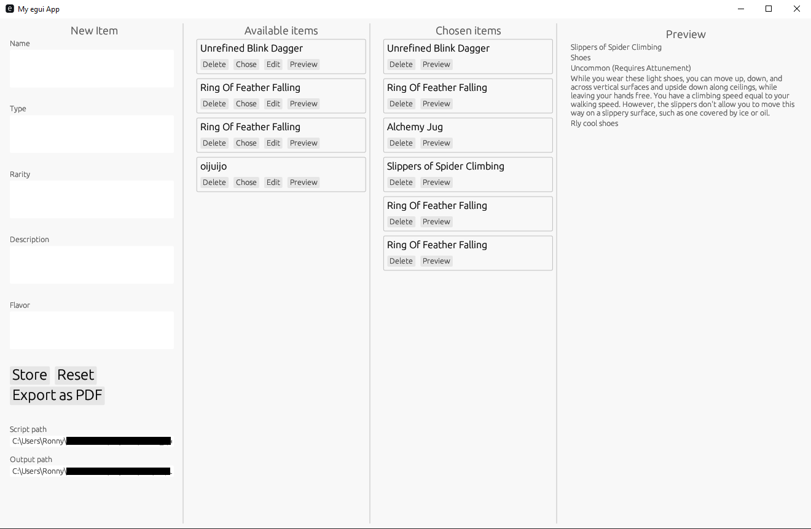
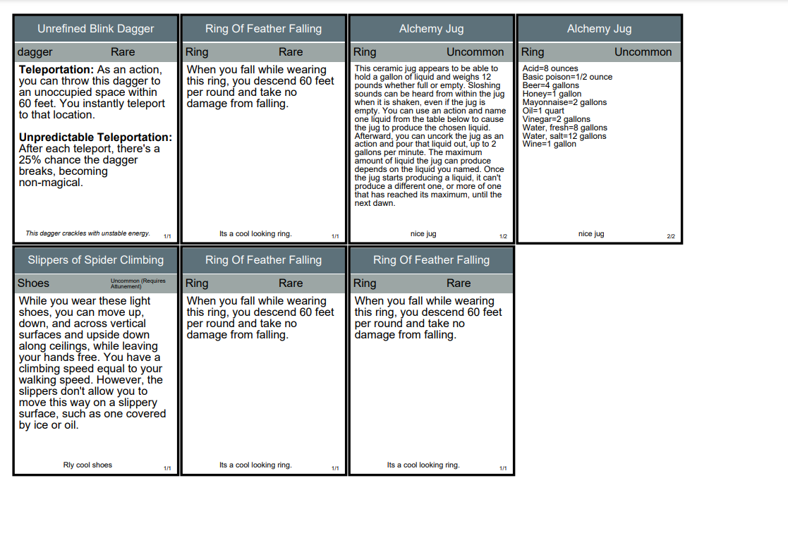

# Dungeon & Cards (DNC)

Dungeon & Cards (DNC) is a dedicated Windows application designed to create Dungeons & Dragons cards to print those

## Features

- **Create PDFs:** Easily generate PDFs of cards for your D&D games.
- **Manage Cards:** Save and manage cards to streamline your card creation process.

## Underlying Technology

DNC leverages a private Python library to create and style the PDFs.

## App Screenshot

The current WIP design of the app:

## Sample PDF Output

Below is an example of a PDF created using DNC.

